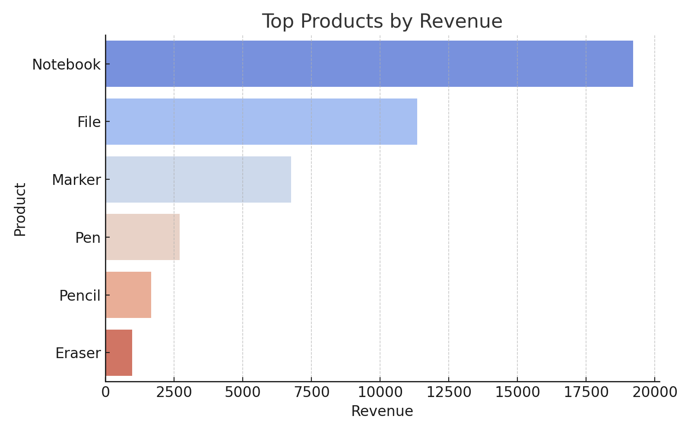
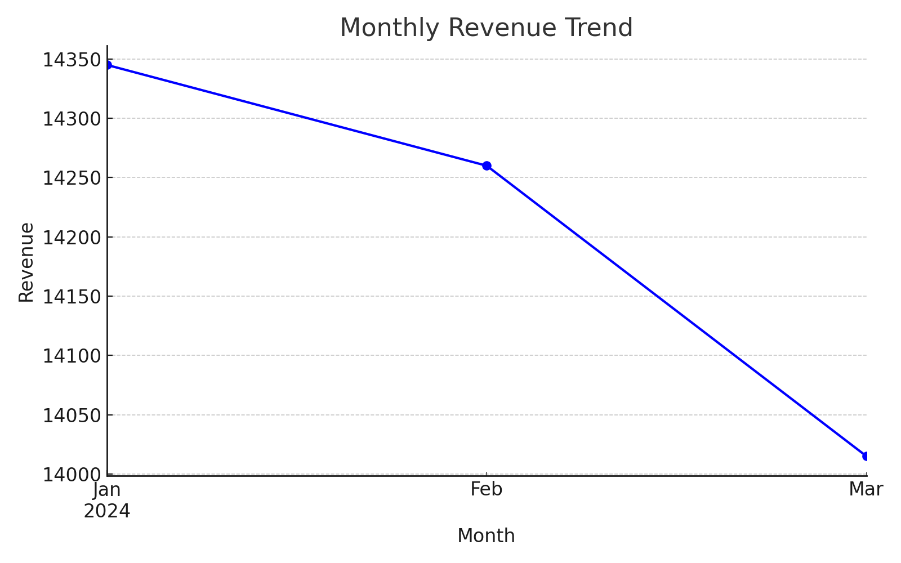

# 🛒 Customer Purchase Behavior Analysis

This project analyzes customer purchase data to uncover patterns in product performance, customer demographics, and regional sales trends. It demonstrates how data analytics can be used to derive actionable business insights.

---

## 📊 Features

- Analyze top-selling products by revenue
- Visualize monthly revenue trends
- Segment customers by gender, age group, and region
- Generate insightful visualizations (bar charts, line plots, pie charts, heatmaps)

---

## 🛠️ Tools & Technologies

- Python
- Pandas
- NumPy
- Matplotlib
- Seaborn
- Jupyter Notebook / VS Code

---

## 📁 Files Included

- `customer_purchases.csv` – Sample dataset
- `top_products.png` – Top products by revenue
- `monthly_revenue.png` – Monthly revenue line graph
- `gender_distribution.png` – Pie chart of gender data
- `region_category_heatmap.png` – Revenue by region and category

---

## 🚀 How to Run

1. Clone the repository  
   ```bash
   git clone https://github.com/yourusername/customer-purchase-analysis.git
   cd customer-purchase-analysis
   ```

2. Install dependencies  
   ```bash
   pip install pandas matplotlib seaborn
   ```

3. Run your analysis script or Jupyter notebook

---

## 📌 Project Goals

- Understand customer behavior through data
- Help businesses make data-driven decisions
- Build a foundation for predictive analytics and business intelligence

---

## 📷 Sample Outputs




---

## 📄 License

This project is for educational use and personal learning. You are free to fork and build upon it.

---

## 🙌 Author

**Suresh V**  
Aspiring Data Analyst | Python Enthusiast | GitHub: [@yourusername](https://github.com/yourusername)
